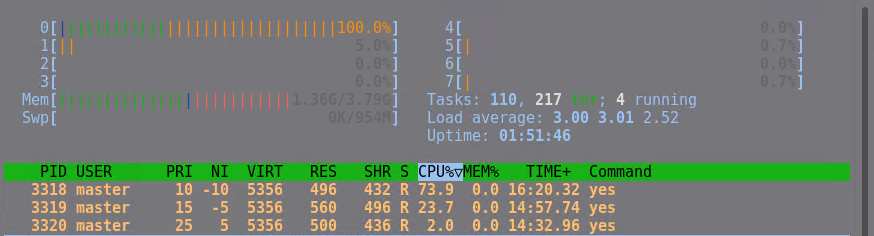

# **Linux Süreç Yönetimi**

## Linux Süreç (Process) Durumları

Linux'ta bir süreç, yaşam döngüsü boyunca aşağıdaki durumların birinde olabilir:

### **1. New (Yeni, Yaratılıyor)**

  - Yeni bir süreç oluşturulduğunda bu duruma girer.
  - Süreç henüz tam olarak başlatılmamış ve çekirdek tarafından planlanmamıştır.

  - Eğer süreç başarılı şekilde oluşturulursa `Runnable (Çalışmaya Hazır)` durumuna geçer.
  - Eğer süreç oluşturulamazsa süreç başarısız olur ve işletim sistemi tarafından temizlenir.

### **2. Runnable (Çalışmaya Hazır)**

  - Süreç çalıştırılabilir durumda, ancak CPU tarafından çalıştırılmak için planlama sırasında bekliyor.
  - CPU tarafından çalıştırılmak üzere seçilirse `Running` olur.
  - Eğer beklenmesi gereken bir olay varsa `Sleeping` durumuna geçebilir.

### **3. Running (Çalışıyor)**

  - Süreç şu anda CPU tarafından aktif olarak çalıştırılıyor.
  - Linux'ta aynı anda birden fazla süreç çalıştırılabilir, ancak her CPU çekirdeği yalnızca bir süreci aynı anda çalıştırabilir.

  - Zaman dilimi (time slice) sona erdiğinde `Runnable` duruma döner.
  - Eğer süreç bir I/O işlemi bekliyorsa `Sleeping` durumuna geçer.
  - Eğer süreç tamamlanırsa `Terminated (Sonlandırılmış)` olur.


### **4. Sleeping (Uyku Modu)**
#### **4.1 Interruptible Sleep (Kesilebilir Uyku, `S`)**

  - Süreç, bir olayın tamamlanmasını bekliyor, ancak sinyaller tarafından uyandırılabilir.

  - Beklenen olay gerçekleşirse `Runnable` veya `Running` duruma geçer.
  - Süreç bir sinyal alırsa `Runnable` olur.

#### **4.2 Uninterruptible Sleep (Kesilemez Uyku, `D`)**
 
  - Süreç, genellikle donanım veya kritik bir çekirdek işlemi bekliyor.
  - Bu durumda süreç sinyal ile `Running` olmaz çağrı ile `Running` olabilir.

  - İşlem tamamlandığında süreç `Runnable` veya `Running` olur.

### **5. Stopped (Durdurulmuş, `T`)**

  - Süreç bir sinyal (`SIGSTOP`, `SIGTSTP`) ile durdurulmuştur.

  - `SIGCONT` sinyali alırsa süreç tekrar `Runnable` olur.

### **6. Zombie (Zombi, `Z`)**

  - Süreç tamamlanmış ancak ebeveyn süreci tarafından hala temizlenmemiştir.

### **7. Idle (Boşta, `I`)**

  - Sistem çekirdeğinde, hiçbir süreç çalışmıyorsa CPU'nun boşta kalmasını yöneten süreçler `Idle` durumuna girer.

### **8. Terminated (Sonlandırılmış)**

  - Süreç çalışmasını tamamladı ve artık işletim sistemi tarafından kaldırılmak üzere bekliyor.

### **Linux Süreç Durumları Arasındaki Geçişler**

| **Geçiş** | **Açıklama** |
|-----------|-------------|
| `New` → `Runnable` | Süreç başarıyla oluşturuldu. |
| `Runnable` → `Running` | CPU tarafından seçildi ve çalıştırılıyor. |
| `Running` → `Sleeping` | I/O veya başka bir olay bekliyor. |
| `Sleeping` → `Runnable` | Beklenen olay gerçekleşti, çalışmaya hazır. |
| `Running` → `Zombie` | Süreç tamamlandı ama ebeveyn henüz kaldırmadı. |
| `Zombie` → **(Sistemden Silindi)** | `wait()` çağrıldı, süreç temizlendi. |
| `Running` → `Stopped` | `SIGSTOP` veya `SIGTSTOP` ile durduruldu. |
| `Stopped` → `Runnable` | `SIGCONT` sinyali alarak devam ediyor. |
| `Running` → `Terminated` | Süreç `exit()` veya `kill` ile sonlandı. |

Bu süreçlerin durumlarını `ps aux` veya `top` komutları ile kontrol edebilirsin.


## **Grafiksel Süreç yönetimi**

Kullandığınız masaüstü ortamına göre farklı işlem yönetimi uygulamaları vardır. Ama başka ortamın uygulamayı kullanmak için yükleyebilirisiniz.

Aşağıda Gnome ve KDE distroların uygulamaları gösterilmiştir.

**Gnome**


**KDE**


## **CLI Süreç yönetimi**

### **TOP**

`top `komutuyla kullanılabilir.


| Sütun   | Açıklama |
|---------|----------|
| **PID** | Her bir çalışmakta olan işlemin benzersiz kimlik numarası (Process ID). |
| **USER** | İşlemi başlatan kullanıcı adı. |
| **PR** (Priority) | İşlemin öncelik değeri. Daha düşük sayı daha yüksek önceliği ifade eder. |
| **NI** (Nice value) | İşlemin "nice" değeri, işlemin önceliğini belirler. Bu değer genellikle -20 (en yüksek öncelik) ile +19 (en düşük öncelik) arasında değişir. |
| **VIRT** | İşlem için ayrılan toplam sanal bellek miktarı (bellek dahilindeki tüm dosyalar, yığınlar ve diğer kaynaklar). |
| **RES** (Resident Memory) | İşlem tarafından kullanılan fiziksel bellek (RAM) miktarı. Bu değer, işlem belleğinde şu anda bulunan gerçek veri miktarını ifade eder. |
| **SHR** (Shared Memory) | İşlem tarafından paylaşılan bellek miktarı. Diğer işlemlerle paylaşılan bellek alanını gösterir. |
| **S** (Status) | İşlemin durumunu gösterir. Yaygın durumlar: <br> `S`: Uyuyor (Sleeping) <br> `R`: Çalışıyor (Running) <br> `Z`: Zombi (Zombie) <br> `T`: Duraklatılmış (Stopped) <br> `D`: Uyuyor (Uninterruptible sleep) |
| **%CPU** | İşlemin CPU kullanımı oranı (saniyede kullanılan CPU zaman dilimi). Yüksek bir yüzde, işlemin CPU'yu yoğun şekilde kullandığını gösterir. |
| **%MEM** | İşlemin kullandığı toplam bellek oranı. Sistemdeki toplam bellek miktarına göre, işlem tarafından kullanılan bellek yüzdesi. |
| **TIME+** | İşlemin CPU üzerinde geçirdiği toplam zaman. Bu süre, işlem başlatıldığından itibaren geçen toplam zaman dilimini gösterir. |
| **COMMAND** | Çalışan işlemin komut veya program adı. Bu sütun, işlemi başlatan komutun adını gösterir. |


| Tuş   | İşlevi                                                              |
|-------|---------------------------------------------------------------------|
| **h** | Yardım menüsünü gösterir.                                           |
| **P** | Çıktıyı CPU kullanımına göre sıralar (en yüksek CPU kullanımı).      |
| **M** | Çıktıyı bellek kullanımına göre sıralar (en fazla bellek kullanan).  |
| **T** | Çıktıyı çalışma süresine göre sıralar (en uzun süre çalışan).       |
| **N** | İşlemleri PID'ye göre sıralar.                                                     |
| **R** | İşlemleri tersten  sıralar.                                                     |
| **k** | Bir işlem sonlandırılır. PID girilmesi gerekir.                     |
| **q** | `top` komutundan çıkış yapar.                                        |
| **c** | Komut satırını gösterir/gizler (işlemi başlatan komut).             |
| **u** | Belirli bir kullanıcıya ait işlemleri göstermek için kullanıcı adı girilmesini sağlar. |    
| **O** | Belirli bir kolanda arama işlemleri yapmak için kullanılır. |                                         
| **s** | Yenileme süresini değiştirir.                                       |
| **1** | Çekirdek işlemcilerinin kullanımını tek tek gösterir.                |
| **f** | Tabloda görünmesi istenilen ek özelliklerin seçilmesi için kullanılır. |


### `ps` Komutu 

ps (process status) komutu, Linux tabanlı sistemlerde çalışan süreçleri (process) görüntülemek için kullanılır. 

| Parametre | Açıklama |
|-----------|---------|
| `-e` | Sistemdeki tüm süreçleri gösterir. |
| `-f` | Süreçleri tam formatlı (full-format) olarak gösterir. |
| `-u <kullanıcı>` | Belirtilen kullanıcının süreçlerini listeler. |
| `-p <PID>` | Belirtilen süreç kimliğine (PID) sahip süreci gösterir. |
| `-T` | Mevcut terminalde çalışan süreçleri gösterir. |
| `-a` | Başka kullanıcıların süreçlerini de içerecek şekilde gösterir. |
| `-x` | Terminale bağlı olmayan süreçleri de listeler. |
| `-o <alan>` | Çıktıyı belirlenen sütunlarla özelleştirir (örn. `ps -o pid,cmd,%cpu,%mem`). |
| `-C <komut adı>` | Belirli bir komut adıyla çalışan süreçleri listelemek için kullanılır. |


### `pstree` Komutu Nedir?

`pstree` komutu, Linux  tabanlı sistemlerde süreçlerin hiyerarşik yapısını (ebeveyn-çocuk ilişkisi) ağaç biçiminde görüntülemek için kullanılır.


| Parametre | Açıklama |
|-----------|---------|
| `-p` | Süreçlerin PID'lerini de gösterir. |
| `-u` | Süreçleri çalıştıran kullanıcı adlarını gösterir. |
| `-a` | Süreçlerin çalıştırıldığı argümanları gösterir. |
| `-n` | Süreçleri PID sırasına göre sıralar. |
| `-h` | Mevcut işlemi vurgular. |
| `-c` | Aynı komutlarla başlatılan süreçleri birleştirmeden ayrı ayrı gösterir. |


### `pgrep` Komutu Nedir?

`pgrep` komutu, Linux  sistemlerinde belirli bir ada veya kritere göre çalışan süreçleri bulmak için kullanılır. `ps` komutundan farklı olarak, doğrudan bir sürecin PID’sini (Process ID) döndürür.

```bash
pgrep <süreç_ismi>
```
Bu komut, belirtilen sürecin PID’sini döndürür.


| Parametre | Açıklama |
|-----------|---------|
| `-l` | Sürecin PID’si ile birlikte adını da gösterir. |
| `-u <kullanıcı>` | Belirtilen kullanıcıya ait süreçleri listeler. |
| `-P <PID>` | Belirtilen PID’ye sahip sürecin alt süreçlerini bulur. |
| `-a` | Süreçlerin tam komut satırlarını gösterir. |
| `-n` | En son başlatılan sürecin PID’sini döndürür. |
| `-o` | En eski sürecin PID’sini döndürür. |
| `-f` | Bu komut, komut satırında aranan_kelime geçen tüm süreçlerin PID'lerini döndürür. |
| `-d <ayırıcı>` | Çıktıyı belirli bir ayırıcı ile böler (örn. `,` ile ayırma). |


---
---


## **Süreçlere Sinyal Gönderme**

### `kill` Komutu 

`kill` komutu, Linux  sistemlerinde **belirtilen PID’ye sahip bir sürece sinyal göndermek** için kullanılır. Bu sinyal, süreci sonlandırmak, durdurmak veya belirli bir işlem yaptırmak için kullanılabilir.

### **Temel Kullanım**
```bash
kill <PID>
```
Bu komut, varsayılan olarak `SIGTERM (15)` sinyalini göndererek süreci nazikçe sonlandırmaya çalışır.

Örnek:
```bash
kill 1234
```
Bu, `1234` PID’sine sahip süreci sonlandırmaya çalışır.

### **Sinyaller ve Anlamları**

| Sinyal | Numarası | Açıklama |
|--------|---------|---------|
| `SIGTERM` | `15` | Süreci nazikçe sonlandırır. |
| `SIGKILL` | `9` | Süreci anında zorla sonlandırır. |
| `SIGSTOP` | `19` | Süreci duraklatır (arka plana alır). |
| `SIGCONT` | `18` | Duraklatılan süreci devam ettirir. |
| `SIGINT` | `2` | Klavyeden `Ctrl + C` kombinasyonu ile gönderilen sinyaldir. |

### **Örnek Kullanımlar**

#### **1. Bir Süreci Nazikçe Sonlandırma**
```bash
kill 1234
```
Bu, PID’si `1234` olan sürece `SIGTERM (15)` sinyali gönderir.

#### **2. Bir Süreci Zorla Sonlandırma (Öldürme)**
```bash
kill -9 1234
```
veya
```bash
kill -SIGKILL 1234
```
Bu komut, `SIGKILL (9)` sinyali ile süreci anında öldürür.

#### **3. Bir Süreci Duraklatma**
```bash
kill -19 1234
```
veya
```bash
kill -SIGSTOP 1234
```
Bu, süreci duraklatır (arka plana alır).

#### **4. Duraklatılan Bir Süreci Devam Ettirme**
```bash
kill -18 1234
```
veya
```bash
kill -SIGCONT 1234
```
Bu, duraklatılan süreci kaldığı yerden devam ettirir.

#### **5. Tüm Süreçlere Belirli Bir Sinyal Gönderme**
```bash
kill -1 -1
```
Bu, sistemdeki tüm süreçlere `SIGHUP (1)` sinyalini göndererek onları yeniden başlatmaya çalışır.

#### **6. Belirli Bir Sürecin Yeniden Başlatılması**
```bash
kill -HUP 1234
```
Bu, `1234` PID’li sürece `SIGHUP (1)` sinyali göndererek onu yeniden başlatmaya çalışır.

#### **7. Sinyallerin Numaraları **
```bash
kill -l
```


#### **Alternatif Komutlar**

**`pkill`**: Süreç adını kullanarak sinyal gönderir.
  ```bash
  pkill -9 firefox
  ```
**`killall`**: Belirtilen ada sahip tüm süreçleri öldürür.
  ```bash
  killall -9 apache2
  ```

## **Süreçlere İşlemci(core) Atama**

  **`taskset -cp`**: Süreç id si kullanılarak süreci hangi işlem biriminin çalıştıracağını belirler.
  ```bash
  taskset -cp 1234
  ```

  Aşağıda top uygulamasının gelişmiş hali olan htop uygulaması kullanılmıştır kullanabilmek için kurulum gerekir.

Uygulamada görüldüğü üzere 3 tane yes komutu çalışmaktadır.


taskset -cp komutuyla yes processlerini 0 numaralı işlemciye atadık.


---
---

## **Linux'ta PR (Priority) ve Öncelik Kavramı**

**PR (Priority)**, bir işlemin (process) işletim sistemi tarafından ne kadar öncelikli olarak çalıştırılacağını belirleyen bir değerdir. 

**Nice Değeri**

  - Nice değeri, bir işlemin kullanıcı tarafından ayarlanan önceliğidir. Bu değer, işlemin çalışma önceliğini belirler ve değeri -20 ile 19 arasında değişir.

  - Nice değeri ne kadar düşükse, o kadar yüksek önceliğe sahip olur.

  - Nice değeri ne kadar yüksekse, o kadar düşük önceliğe sahip olur.

Aşağıda tek bir işlem birimine atanmış 3 tane yes komutu bulunmaktadır.


```bash
  renice -n <değişim miktarı> 1234
  ```

  

Öncelikler değiştirildikten sonra işlemci her işlemlere önceliğine göre zaman ayırmaya başlamıştır.




```bash
  nice -n <başlangıç nı değeri >  <komut / script>
  ```


